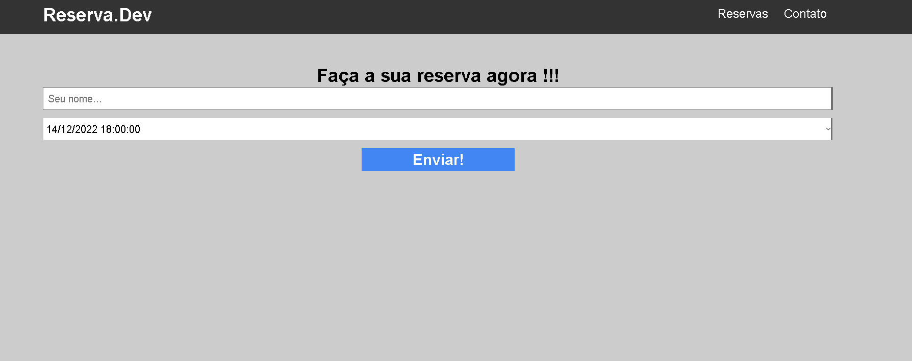

<h1 align="center"> Sistema de Reservas</h1>

  <a href="#-tecnologias">Tecnologias</a>&nbsp;&nbsp;&nbsp;|&nbsp;&nbsp;&nbsp;
  <a href="#-projeto">Projeto</a>

 

  
   
  

## 💻 Projeto

Um sistemas de reservas, utilizando php e banco de dados!

## 🚀 Tecnologias

Esse projeto foi desenvolvido com as seguintes tecnologias:

- HTML e CSS
- PHP
- Mysql
- PhpMyAdmin

